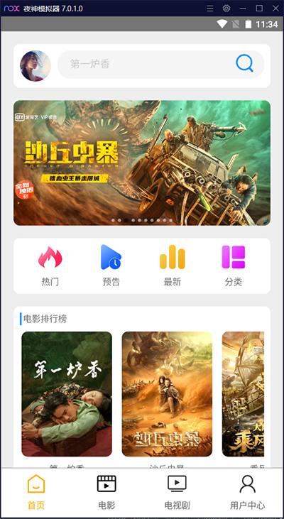
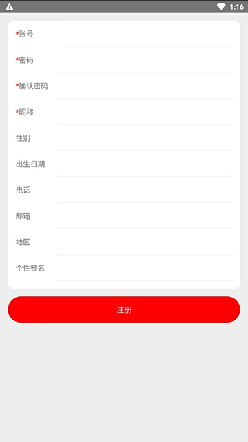

# android电影APP

开发者：吴怨吴悔

=============================界面预览（如果无法预览，请查看项目根目录png文件）==========================

=============================界面预览（如果无法预览，请查看项目根目录png文件）==========================

所有影片数据来自第三方电影网站，使用python爬虫实时抓取，然后存入到自己的mysql数据库中，所有接口均采用java开发

后端接口项目和sql语句：https://github.com/wuyuanwuhui99/springboot-app-service

flutter版本参见:    
通用地址：https://github.com/wuyuanwuhui99/flutter-movie-app-ui   
国内镜像地址：https://hub.nuaa.cf/wuyuanwuhui99/flutter-movie-app-ui

react native版本参见:   
通用地址：https://github.com/wuyuanwuhui99/react-native-app-ui   
国内镜像地址：https://hub.nuaa.cf/wuyuanwuhui99/react-native-app-ui   

在线音乐和电影后端接口项目和sql语句：   
通用地址：https://github.com/wuyuanwuhui99/springboot-app-service   
国内镜像地址：https://hub.nuaa.cf/wuyuanwuhui99/springboot-app-service

harmony鸿蒙java版本参见:   
通用地址：https://github.com/wuyuanwuhui99/Harmony_movie_app_ui   
国内镜像地址：https://hub.nuaa.cf/wuyuanwuhui99/Harmony_movie_app_ui

harmony鸿蒙arkts版本参见:   
通用地址：https://github.com/wuyuanwuhui99/Harmony-arkts-movie-music-app-ui   
国内镜像地址：https://hub.nuaa.cf/wuyuanwuhui99/Harmony-arkts-movie-music-app-ui

java安卓原生版本参见：   
通用地址：https://github.com/wuyuanwuhui99/android-java-movie-app-ui   
国内镜像地址：https://hub.nuaa.cf/wuyuanwuhui99/android-java-movie-app-ui

kotlin安卓原生版本参见：   
通用地址：https://github.com/wuyuanwuhui99/android-kotlin-jetpack-movie-app   
国内镜像地址：https://hub.nuaa.cf/wuyuanwuhui99/android-kotlin-jetpack-movie-app

微信小程序版本参见：  
通用地址: https://github.com/wuyuanwuhui99/weixin-movie-app-ui   
国内镜像地址：https://hub.nuaa.cf/wuyuanwuhui99/weixin-movie-app-ui

uniapp版本参见：  
通用地址: https://github.com/wuyuanwuhui99/uniapp-vite-vue3-ts-movie-app-ui   
国内镜像地址：https://hub.nuaa.cf/wuyuanwuhui99/uniapp-vite-vue3-ts-movie-app-ui

vue2在线音乐项目：  
通用地址: https://github.com/wuyuanwuhui99/vue-music-app-ui   
国内镜像地址: https://hub.nuaa.cf/wuyuanwuhui99/vue-music-app-ui

在线音乐后端项目：  
通用地址: https://github.com/wuyuanwuhui99/koa2-music-app-service   
国内镜像地址: https://hub.nuaa.cf/wuyuanwuhui99/koa2-music-app-service

vue3+ts明日头条项目：  
通用地址: https://github.com/wuyuanwuhui99/vue3-ts-toutiao-app-ui   
国内镜像地址: https://hub.nuaa.cf/wuyuanwuhui99/vue3-ts-toutiao-app-ui